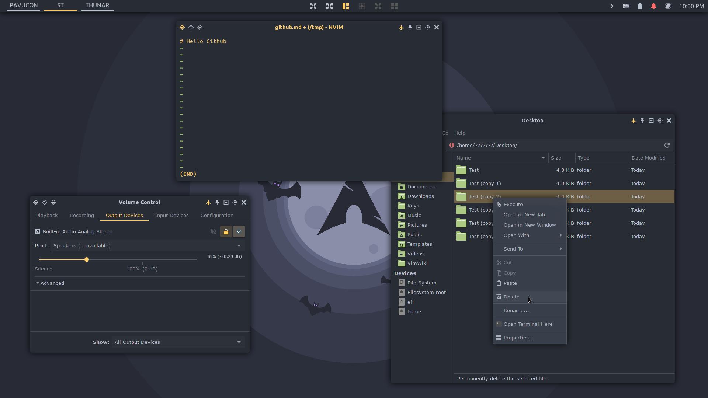

# ricksdomein-gtk-theme

A Material Design-like theme for GTK+ based environments.

Screenshot Details: Icons: [ricksdomein-icon-theme](https://github.com/ricksdomein/ricksdomein-icon-theme) | Window Manager: [awesomewm](https://github.com/ricksdomein/awesomewm) | [Wallpaper](https://draculatheme.com/wallpaper) | Terminal Font: Ubuntu

> Arch user can use `makepkg -sic` to install this theme or use my [repo](https://github.com/ricksdomein/ricksdomein-arch-repo)

## Motivation

This themes provide a fancy neutral dark-balanced color-scheme designed to be __useful__ for a few specific goals.

1. __Minimize eye strain__: when you pass many hours in front of the screen or you are hyper-sensitive to light, saturation and contrast.

2. __Avoid disrupting your circadian rhythms__: a neutral color-cast-free UI helps your body to produce enough melatonin at night time and sleep better, working nicely with software like `redshift`.

## Credits

- All credits go to the [Materia Theme](https://github.com/nana-4/materia-theme), its author and contributors.
